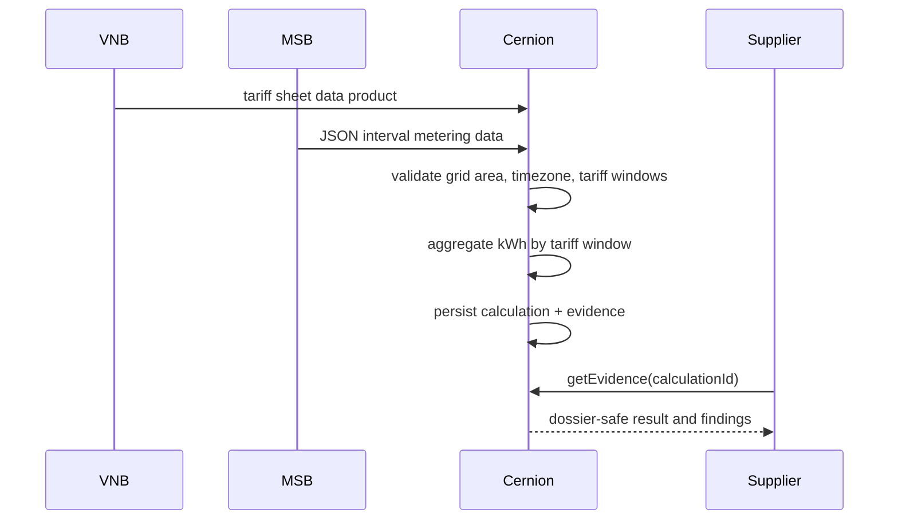

# Re4DE-Aligned Layer-3 Variable Grid Fees

Issue: #224

## Positioning

Cernion is not positioned as a neutral sector-wide Re4DE data space. The first implementation is a Re4DE-aligned Layer-3 value service that turns catalog-like data products and interval metering data into deterministic grid-fee calculations, evidence objects, and dossier-ready facts.

This slice does not claim full EDC, DSP, SSI, VC, or Pontus-X protocol compliance. It keeps an upgrade path by using explicit data-product metadata, OpenAPI-described REST actions, stable JSON schemas, tenant-scoped evidence, and conservative Re4DE wording.

## Layer Mapping

- Layer 0 existing systems: ERP, billing, MDM, MSB interval metering, GIS, HEMS, flexibility platforms.
- Layer 1 interoperability: REST/JSON adapter shape, bearer-token service identity, catalog-compatible metadata, audit log hooks.
- Layer 2 Cernion data services: tariff-sheet data product, JSON interval metering input, §14a context, calculation result, evidence object.
- Layer 3 value service: deterministic tariff-window aggregation, validation findings, base-price proration, evidence generation.
- Layer 4 workspace/API/UI: supplier/VNB evidence retrieval, Answer Dossier hydration, future cockpit presentation.

## Runtime Boundary

Service: `re4de-variable-grid-fee`

- `calculate`: non-consequential audit-write. It writes a tenant-scoped calculation artifact only.
- `getCalculation`: read-only retrieval of the calculation artifact.
- `getEvidence`: read-only dossier-safe slim evidence retrieval.

Non-goals:

- Full Re4DE/DSP connector.
- SSI/VC credential issuance.
- Native EDIFACT/MSCONS/TAF-7 parsing.
- Billing, settlement, MaKo, or device-control writes.
- §14a reduced-grid-fee legal settlement automation.
- Personal Agent hardcoding.

## Sequence



## Tariff Sheet Schema

Schema name: `cernion.re4de.tariffSheet.v1`

```json
{
  "tariffSheetId": "vgf-sheet-001",
  "version": "1.0.0",
  "validFrom": "2026-01-01",
  "validTo": "2026-12-31",
  "publishedBy": "vnb-demo",
  "gridAreaId": "grid-area-demo",
  "gridOperatorId": "vnb-demo",
  "currency": "EUR",
  "priceUnit": "ct/kWh",
  "timezone": "Europe/Berlin",
  "basePriceEurPerYear": 365,
  "windows": [
    {
      "windowId": "workday-highload",
      "dayType": "workday",
      "from": "07:00",
      "to": "22:00",
      "priceCtPerKwh": 8.5,
      "priority": 100
    }
  ]
}
```

## Metering Input

```json
{
  "maloId": "DE00123456789",
  "meloId": "DE00987654321",
  "resolution": "PT15M",
  "timezone": "Europe/Berlin",
  "values": [
    {
      "from": "2026-01-01T00:00:00+01:00",
      "to": "2026-01-01T00:15:00+01:00",
      "kwh": 1.23
    }
  ]
}
```

## §14a Context

§14a is context only in v1. It does not change the price unless a tariff sheet explicitly models §14a-specific windows or customer groups.

```json
{
  "section14aConfig": {
    "eligible": true,
    "module": "MODULE_3",
    "deviceId": "wb-test-001",
    "deviceType": "wallbox",
    "minimumGuaranteedPowerKw": 4.2,
    "status": "registered"
  }
}
```

## Evidence Object

```json
{
  "found": true,
  "evidenceId": "evidence:re4de-vgf:...",
  "calculationId": "re4de-vgf:...",
  "tariffSheetId": "vgf-sheet-001",
  "tariffSheetVersion": "1.0.0",
  "gridAreaId": "grid-area-demo",
  "totalKwh": 123.45,
  "variableFeeEur": 10.49,
  "basePriceEur": 1.23,
  "totalEur": 11.72,
  "section14aApplied": false,
  "validationFindings": [],
  "sourceActions": ["edm.validation.getIntervals"],
  "calculatedAt": "2026-06-19T09:00:00.000Z"
}
```

## Positive Follow-Ups

- Missing `tariffSheet` enables addition of tariff-sheet id, version, grid area, price windows, and validity period.
- Missing `gridAreaId` enables addition of the canonical routing key for catalog/data-product lookup.
- Missing `meteringIntervals` enables addition of interval-level energy quantities and period coverage.
- Missing `timezone` enables validation of tariff-window applicability.
- Missing `section14aConfig` enables context on controllable-consumption eligibility without automating legal settlement.
